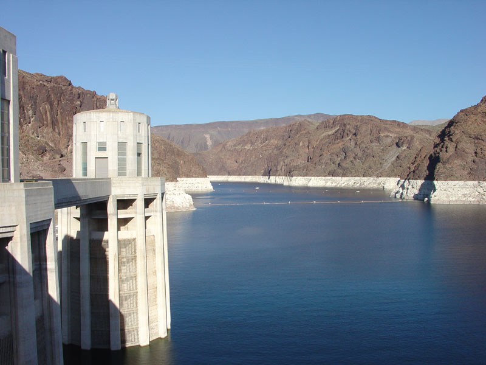
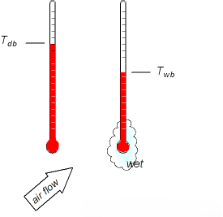
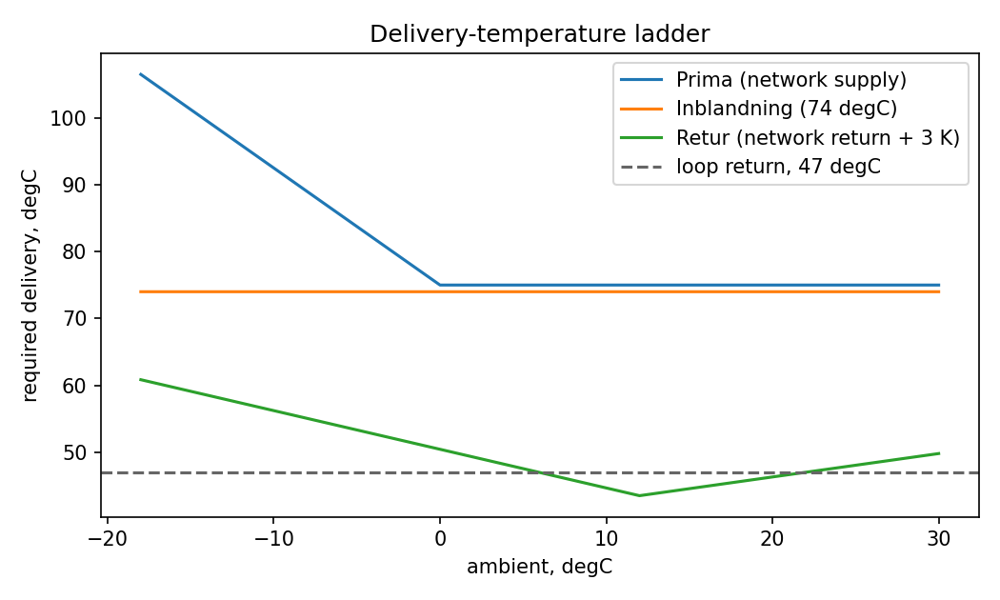
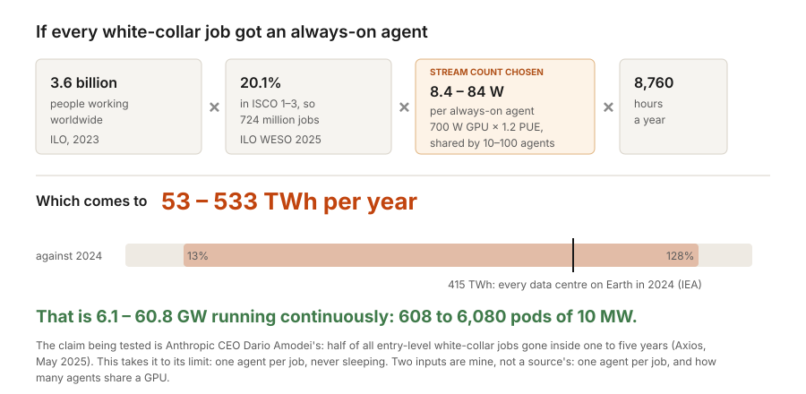
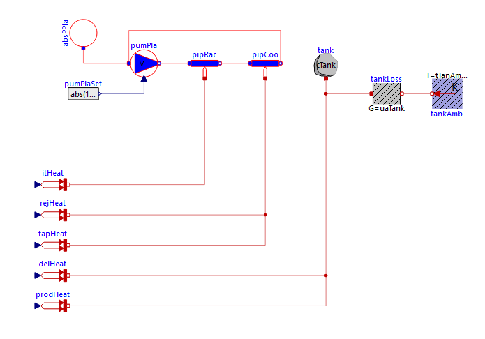
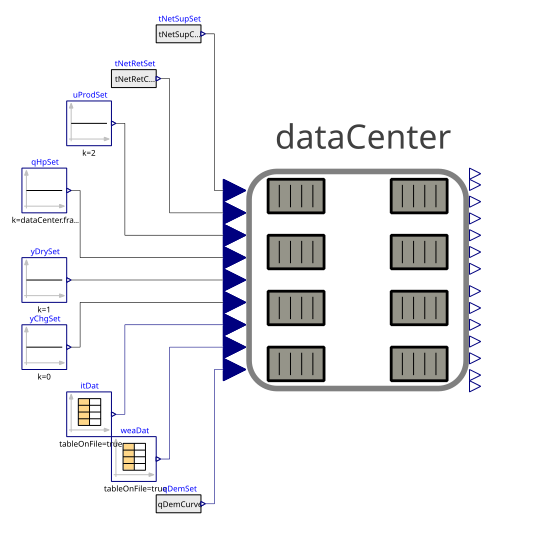
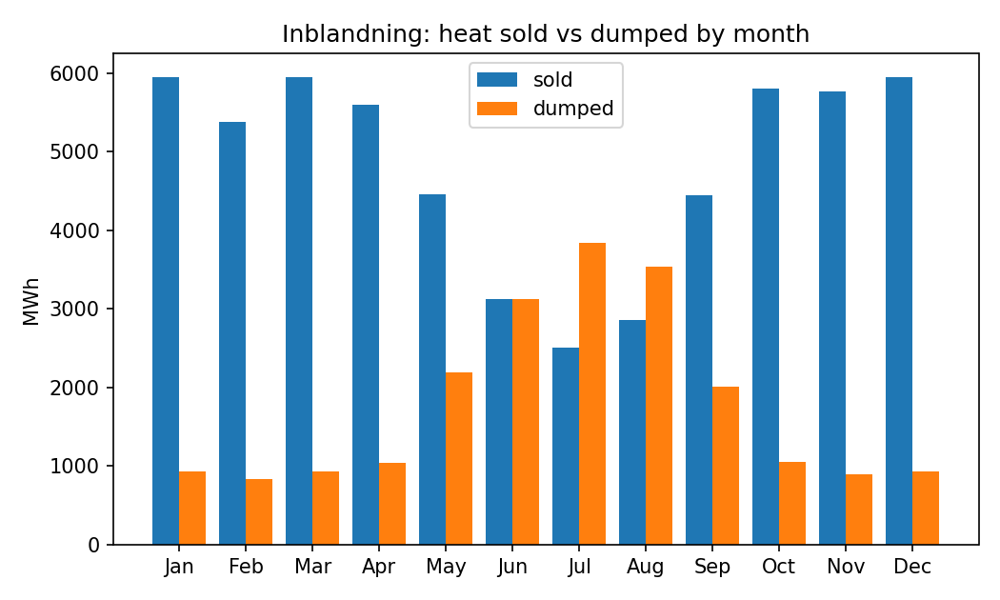

# Why Stockholm, Not Arizona: Where AI Waste Heat Has a Buyer

<!-- markdownlint-disable MD013 -->


*A bathtub ring: mineral left on rock the water used to cover. Lake Mead from Hoover Dam in 2005. The band has grown a great deal since. [USGS](https://www.usgs.gov/media/images/lake-mead-hoover-dam-0), public domain.*
<!-- markdownlint-enable MD013 -->

On August 8, 2026, Lake Mead, the Colorado River's largest reservoir, sat
near its lowest level since it was filled some ninety years ago
([AP](https://www.pbs.org/newshour/nation/lake-mead-hits-historic-low-water-level-as-colorado-river-struggles)).
The same week, developers were still racing to build data centres across the
Arizona desert it waters. Some cool by evaporating the one thing that stretch
of country has least of.

A strange place to make heat you plan to throw away. So when AI's electricity
turns to heat, where should the heat go? Two sites answer in opposite ways, and
it comes down to water.

## The Choice Comes Down to Water

A hot, dry site looks ideal for cooling, because dry air makes evaporative
cooling cheap. It pays when the gap between the two thermometers below is
15–20 °F (8–11 °C) or more
([MEP Academy](https://mepacademy.com/understanding-dry-bulb-wet-bulb-and-wet-bulb-depression/)).

<!-- markdownlint-disable MD013 -->


*Image source: [The Engineering ToolBox](https://www.engineeringtoolbox.com/dry-wet-bulb-dew-point-air-d_682.html).*
<!-- markdownlint-enable MD013 -->

The bare thermometer shows the air temperature (the dry-bulb). The wet one
reads lower, because evaporating water takes heat away. That is the wet-bulb,
the coldest an evaporative cooler can reach. Hot, dry air opens the gap wide.
So the desert cools cheaply, by spending the one thing it has least of.

## Arizona: The Water-Hungry Case

Hot, dry air makes evaporative cooling work well, but it is a choice. Dry air
coolers use no water and cost more in equipment and fan power. Onsite power with
an absorption chiller does not change that, since the chiller still rejects
heat, usually through a cooling tower
([US Department of Energy](https://www.energy.gov/sites/prod/files/2013/11/f4/thermally_activated_lithiumbromide.pdf)).
The EPA's 2007 cost figures price whole packages at old energy prices
([EPA CHP Partnership](https://www.epa.gov/sites/default/files/2015-07/documents/the_role_of_distributed_generation_and_combined_heat_and_power_chp_systems_in_data_centers.pdf)),
so we skip cost.

Instead we use one simple what-if. Take a 10 MW IT pod that gives off 87.6 GWh
of heat a year, and assume a hot, dry site rejects all of it by evaporation. At
about 1.5 litres per kWh, that is roughly 130 million litres of water a year.

This is the water-hungry case on purpose, not a forecast. The choice is real:
Tucson declined the original Project Blue proposal in August 2025
([Grist](https://grist.org/technology/arizona-water-data-centers-semiconducters/)).
The developer moved ahead outside the city with closed-loop air cooling that it
says uses no water for industrial cooling
([AZPM](https://www.azpm.org/s/103423-arizona-water-officials-approve-wells-tied-to-project-blue-data-center/)).

## Stockholm: A Heat Pump and a Buyer

Stockholm gives the same heat a second path. The pod can dump heat through dry
cooling, or lift part of it to a temperature that Stockholm Exergi, the city's
heat network, will buy. The operator sells what the network takes and rejects
the rest.

Two things help. Sweden's grid is 99% low-carbon in 2025 (hydro, wind
and nuclear, with fossil fuels at 1.2%)
([Ember](https://ember-energy.org/countries-and-regions/sweden/);
[World Nuclear Association](https://world-nuclear.org/information-library/country-profiles/countries-o-s/sweden)),
so the heat pump runs on nearly clean power. And Open District Heating pays for
heat instead of charging to dump it.

The question is narrow. For one 10 MW pod in Stockholm, how much heat reaches a
real buyer, and how much is thrown away? This post models the physics, not the
cost or payback.

### What the Network Will Buy

Open District Heating buys heat at three grades. **Retur** goes into the return
line and pays least. **Inblandning** is blended into the network at a fixed
74 °C. **Prima** matches the network's own supply temperature, which rises in
cold weather, and pays most.

<!-- markdownlint-disable MD013 -->

<!-- markdownlint-enable MD013 -->

Prima runs from 68 to 103 °C over a year. Inblandning is 68–80 °C, and we take
the middle, 74 °C. Retur must be at least 3 K above the incoming return
([Öppen Fjärrvärme product sheet](https://www.stockholmexergi.se/wp-content/uploads/2023/05/Produktblad_tjanster_Oppen-Fjarrvarme.pdf)).
The network curves come from Energiforsk 2024:1059, an average over 213 Swedish
systems, not a Stockholm measurement.

How much heat the network takes is our own assumption, and it matters most: a
2 MW summer base, plus 900 kW per kelvin of space heating below 17 °C, capped at
20 MW.

<!-- markdownlint-disable MD013 -->

<!-- markdownlint-enable MD013 -->

Above about 10 °C, the network wants less heat than the pod's liquid loop
makes, and the rest is dumped. Change the base or the slope and that crossing
moves, so every result below depends on numbers we chose.

## How Much Heat Is Coming?

How much heat is coming? Nobody knows, so what follows is a deliberate stress
test, not a forecast.

Anthropic's CEO says AI could take half of all entry-level white-collar jobs
within five years
([Axios](https://www.axios.com/2025/05/28/ai-jobs-white-collar-unemployment-anthropic)).
The ILO is more careful: about a quarter of jobs exposed, with change likelier
than replacement
([ILO](https://www.ilo.org/resource/news/one-four-jobs-risk-being-transformed-genai-new-ilo%E2%80%93nask-global-index-shows)).
We run the extreme case. Take the world's ~724 million manager, professional and
technical jobs
([ILO](https://www.ilo.org/sites/default/files/2025-01/WESO25_Trends_Report_EN.pdf)),
and give each one an AI agent running every hour of the year.

Power per agent is our weakest number. Google reports about 0.24 Wh for a median
Gemini text prompt ([Google](https://arxiv.org/abs/2508.15734)), but a prompt is
not a constant load. We assume a 700 W GPU at a PUE of 1.2, shared by 10 to 100
agents: 8.4 to 84 W each, for 8,760 hours.

<!-- markdownlint-disable MD013 -->

<!-- markdownlint-enable MD013 -->

That gives 53 to 533 TWh a year. The low end is an eighth of what all data
centres on Earth used in 2024 (about 415 TWh). The high end is more than all of
them together. That is 608 to 6,080 pods of 10 MW. It is a scenario, not a
prediction, and in every version the electricity becomes heat. So let us zoom
in on one pod.

## Inside One Pod

We modelled the pod in Modelica and exported it as one FMU. It runs as a study
here, reading a year of Stockholm weather. Later, the same FMU runs as the plant
itself, taking commands from an orchestrator.

A closed loop carries the liquid-cooled 80% of the pod's heat:

<!-- markdownlint-disable MD013 -->
![A closed loop carries the liquid-cooled IT heat: the rack-side pipe picks it up and returns it five kelvin hotter to the cooling-side pipe, which sends it back to the rack. From the cooling side the heat leaves two ways: through a heat pump to the district network, or out to ambient through a dry cooler. The accumulator tank sits downstream of the heat pump, in parallel with the delivery path: a charge command diverts lifted heat that would otherwise be sold into the tank, and a discharge command adds heat from the tank on top of production](images/post1-pod-loop.svg)
<!-- markdownlint-enable MD013 -->

The pump keeps a constant 5 K rise across the rack, so flow is a constant
383 kg/s, carrying the loop's 8 MW share of the 10 MW pod. Supply and return
stay at 42.00 °C and 47.00 °C, to the digit, for all 8,760 hours.

<!-- markdownlint-disable MD013 -->


*The same loop in the model itself, exported from OpenModelica (OMEdit).*
<!-- markdownlint-enable MD013 -->

The heat pump and delivery path are equations, linked to the loop through
heat-flow blocks:

```modelica
tapHeat.Q_flow = -qTap;   // evaporator duty, drawn off the cooling pipe
prodHeat.Q_flow = qProd;  // condenser duty, delivered to the tank node
delHeat.Q_flow = -qDel;   // delivery, drawn out of the tank node
```

The first two lines are the two ends of the heat pump: heat in at the cold end
(evaporator), heat out hotter at the hot end (condenser). The difference is
compressor work. So there is no heat pump block, only the gap between them.

<!-- markdownlint-disable MD013 -->


*The same pod wired to its drivers, on the left, that step it over the weather year.*
<!-- markdownlint-enable MD013 -->

### Throwing the Rest Away

Heat the network does not take goes to the air. Below 39 °C ambient, the dry
cooler holds the set point on fan power alone. Past that, a mechanical stage
takes the overflow at a much worse efficiency:

<!-- markdownlint-disable MD013 -->
```modelica
freeCool = tAmbK + dTApproachNominal < tPlaSupNominal;     // ambient cool enough to skip mechanical lift
qRejFreeCap = if freeCool then yDry*qDryCapNominal else 0; // fan capacity on offer, throttled by fan duty
qRejFree = min(qRej, qRejFreeCap);                         // what the fans actually move
qRejMech = qRej - qRejFree;                                // whatever spills past them
pDry = qRejFree/copCoolFree + qRejMech/copCoolMech;        // electricity, one term per stage
```
<!-- markdownlint-enable MD013 -->

In Stockholm the mechanical stage never turns on. The warmest hour is 30 °C, so
every hour runs on fans alone (COP 15).

### The Year, End to End

We run the Stockholm Arlanda TMYx year (8,760 hourly rows, −18.0 °C to 30.0 °C)
once per product, with every set point at its default.

<!-- markdownlint-disable MD013 -->
| Product | Heat sold | of IT energy | IT heat recovered | Heat-pump work | Demand-limited |
| --- | --- | --- | --- | --- | --- |
| Retur | 56,517 MWh | 64.5% | 61.5% | 2,651 MWh | 31.1% of hours |
| Inblandning | 57,768 MWh | 65.9% | 55.7% | 8,986 MWh | 34.9% of hours |
| Prima | 57,768 MWh | 65.9% | 54.6% | 9,918 MWh | 34.9% of hours |
<!-- markdownlint-enable MD013 -->

**Heat sold** includes the compressor work the heat pump added. **IT heat
recovered** is only what came off the IT loop. For Inblandning, the network buys
57,768 MWh, of which 8,986 MWh is compressor electricity. So 48,782 MWh (55.7%)
came from the IT loop.

Three things stand out. **Retur is nearly free for part of the year.** For 38.5%
of hours, the 47 °C loop is already hot enough, so no heat pump is needed.
**The two premium products sell the same heat**, capped by the 8 MW condenser.
Prima lifts higher, so more of that 8 MW is compressor work. **Nothing is
dispatched here.** The storage tank just cools from 47 °C to 15.3 °C.

<!-- markdownlint-disable MD013 -->

<!-- markdownlint-enable MD013 -->

The mismatch is worst in summer, when the pod has the most to sell. Let the
network take everything and delivery reaches 80.0% of IT energy, the 8 MW
condenser limit. The gap from 65.9% is fourteen points, all from hours above
about 10 °C, when the network wants less than the pod makes.

## What the Desert Would Have Evaporated

Now the question from the top gets a number. The pod modelled here evaporates
nothing. The comparison asks what the *same* pod would use at a hot, dry site
that evaporated all its heat, at about 1.5 L per kWh:

<!-- markdownlint-disable MD013 -->

<!-- markdownlint-enable MD013 -->

The 130 million litres comes from the cooling choice. Stockholm uses no onsite
water because its rejection is dry, even if it sold no heat. For Inblandning,
48,782 MWh of IT heat goes to the network. That is about 73 million litres of
the all-evaporative burden. The other 38,818 MWh is about 58 million litres,
avoided because that heat is dry-cooled.

## What This Settles, and What It Doesn't

So where should the heat go? By this model, to a buyer. Over the year, the
Stockholm pod sends 55.7% of its IT heat to the network, billed as 65.9% of IT
energy once the heat pump's lift is counted. It evaporates nothing on site.
These are physical minimums, not a site forecast. A dry-cooled Arizona build
would also use no water, though it would pay in energy and equipment.

The recovery figure rests on a demand curve we picked. Change it and the answer
moves, by up to the fourteen points the summer mismatch showed. There is no
price in the model either, so what really caps summer sales is money, not pipes.

One more limit: the 500 m³ tank is one well-mixed node, so only 1,155 kWh of
the 15,595 kWh it holds ever cycles. A real tank stratifies. Dispatching against
Nord Pool's hourly price is a job for a later post, and this model is built for
it. A real siting decision needs physics and price. This post has the physics.

## Running It Yourself

The annual results come from one notebook with three FMU runs, one per product.
Open `stockholm_pod_annual.ipynb`, next to this post, and run it top to bottom.
It prints the annual table from this post.
