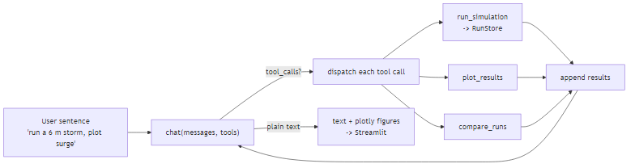
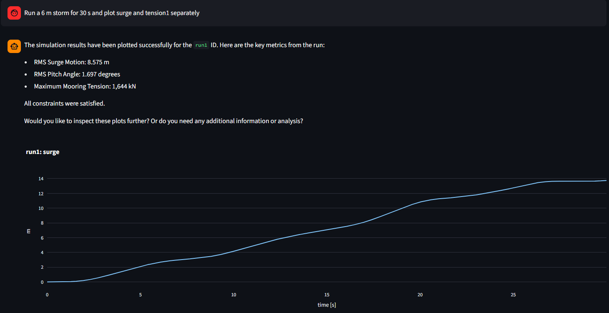
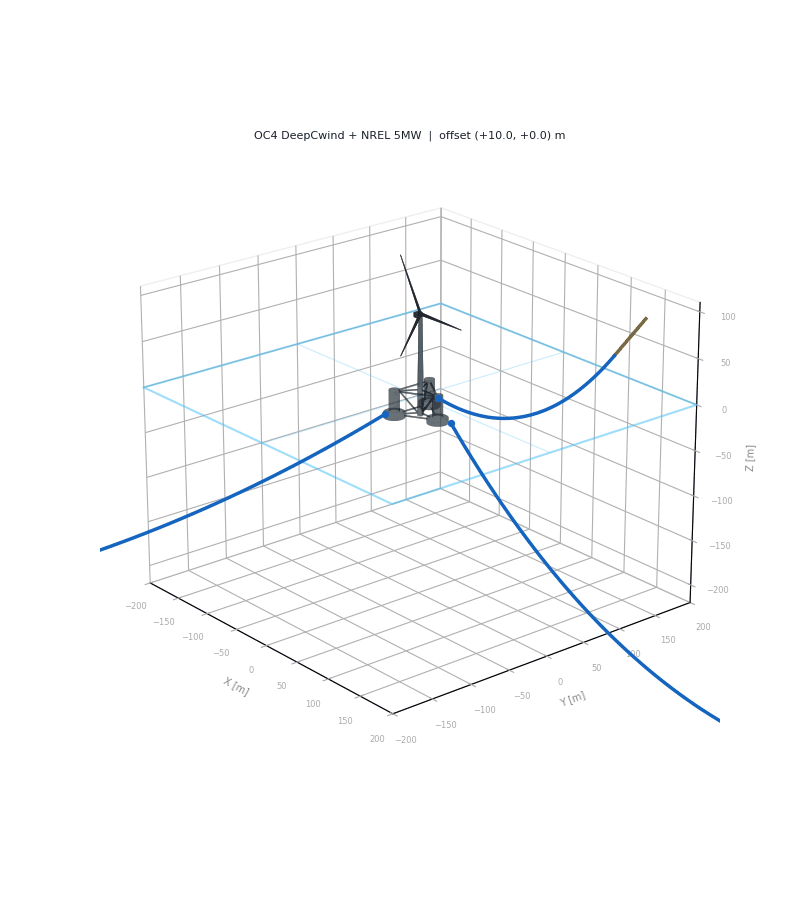
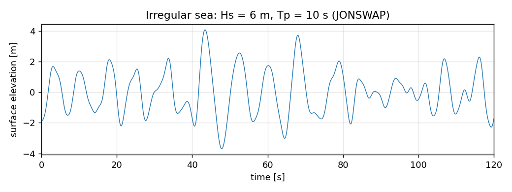
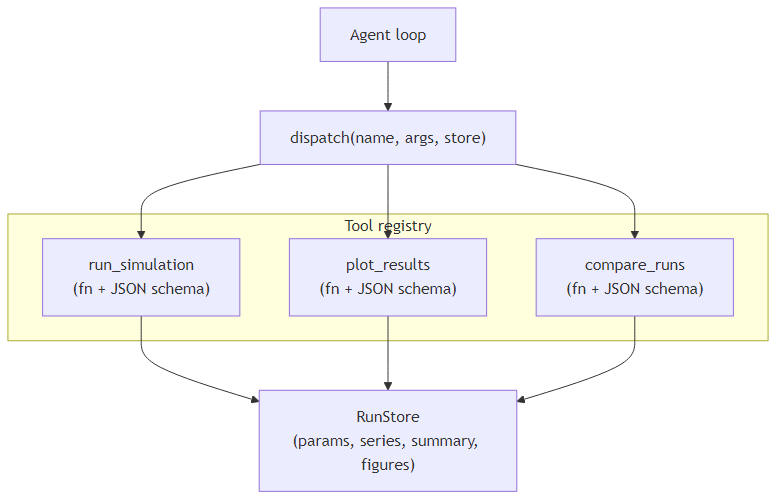
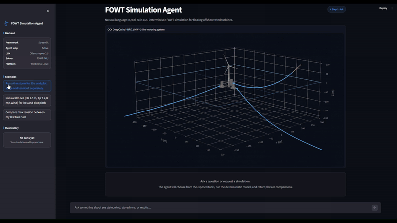
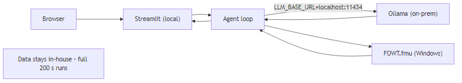

# Who runs your simulation when you're not a simulation engineer?

**tl;dr.** Parts 1 and 2 of this series built a floating-wind mooring model
and turned it into a dynamic co-simulation. By the end of Part 2 the
simulator could already answer real engineering questions. Running it still
meant opening the code and knowing the inputs. Part 3 adds a small
orchestration layer that lets a tool-capable language model call the
simulation I already have, while the numerical model, validation, and
engineering logic remain outside the LLM.

---

## From simulation to interface

In Part 1 I built the mooring surrogate against the OC4 benchmark. In Part 2
I wired the platform, the turbine, and the mooring into an FMU-based
co-simulation that a Python script drives with wind and wave inputs. That
work stands. Nothing in this post replaces any of it.

What Part 3 changes is who gets to run it. The simulator answers useful
questions if you already know its argument names, units, and validated
envelope. Most people asking the questions do not. So this post is about the
thin layer between a plain-language request and the existing `run_cosim`
call. Nothing more.

The pattern is generic. I illustrate it on the floating wind turbine because
that is the simulator I have. The same wiring works over any Python function
with a JSON-serialisable signature.

---

## The problem

Under the hood of this project is the co-simulation from Part 2:

```python
result = run_cosim(
    Hs=6.0,
    Tp=10.0,
    U_hub=12.0,
    TI=0.15,
    duration=30.0,
)
```

`run_cosim()` builds a JONSWAP sea and a Kaimal wind field, solves the
catenary mooring around the platform, and steps the FMU forward. It is
deterministic and tested. Later in this post a thin wrapper
`run_simulation()` injects a `RunStore`, validates inputs, and reduces the
raw output to a summary. `run_cosim` itself is the actual engineering
capability underneath.

The question is how to let someone type

> "Run Hs 6 m, Tp 10 s, wind 12 m/s, TI 0.15, and plot pitch."

and get the same result without opening the file, remembering the argument
order, or knowing the units.

---

## Put an agent in front of it

Architecturally the flow is short. A user sentence goes to a tool-capable
LLM together with a JSON description of the callable Python functions. The
model decides what to call and with what arguments. Python actually runs the
function and hands the result back. The model reads the result and either
replies or calls the next tool.



The important boundary is which side interprets the sentence and which side
runs the code. The model interprets. Python executes. The two never trade
jobs.

---

## One request, end to end

Here is what happens when the user types the storm request above.

The model receives the sentence together with the schema for
`run_simulation`. It emits a `tool_calls` field naming that function and
JSON-encoding the arguments (`Hs=6`, `Tp=10`, `U_hub=12`, `TI=0.15`). No
code has run yet. That payload is data.

The Python loop looks the name up in a registry, calls the real function,
and appends the return value to the conversation as a `role="tool"` message.
The model reads that message, decides it now needs a plot, and emits a
second tool call to `plot_results` with the just-returned run id. The loop
dispatches again. When the model has nothing left to call, it responds in
plain text and the loop exits.



Two tool calls. One simulation. One plot. The engineering result was
produced by the same `run_cosim()` I would have called from a script.

---

## What the LLM actually does

Giving the model a "tool" is not giving it the Python function. What you
send is a JSON description of the function's signature:

```python
run_simulation_schema = {
    "type": "function",
    "function": {
        "name": "run_simulation",
        "description": "Run and store the FOWT FMU for one wind/wave condition.",
        "parameters": {
            "type": "object",
            "properties": {
                "Hs":       {"type": "number"},
                "Tp":       {"type": "number"},
                "U_hub":    {"type": "number"},
                "TI":       {"type": "number"},
                "duration": {"type": "number"},
            },
            "required": ["Hs", "Tp", "U_hub", "TI"],
        },
    },
}
```

The public repo keeps the `minimum`/`maximum` fields on each argument. I
have dropped them here for brevity.

The orchestration loop wraps schema, dispatch, and the LLM call together:

```python
def run_agent(user_text, store, max_steps=6):
    messages = [
        {"role": "system", "content": SYSTEM_PROMPT + "\n\n" + store.context()},
        {"role": "user",   "content": user_text},
    ]

    for _ in range(max_steps):
        response = client.chat.completions.create(
            model=model,
            messages=messages,
            tools=TOOL_SCHEMAS,
        )
        message = response.choices[0].message

        if not message.tool_calls:
            return message.content

        messages.append(message)
        for call in message.tool_calls:
            args   = json.loads(call.function.arguments)
            result = TOOLS[call.function.name](store, **args)
            messages.append({
                "role":         "tool",
                "tool_call_id": call.id,
                "content":      json.dumps(result),
            })

    return "Stopped after the maximum number of tool steps."
```

This is the core orchestration loop I use in the example. Deployment
architecture and application-specific assurance sit alongside the tools in
Python and are outside the scope of this article.

---

## Why the boundary matters

The interface is not accidental. Every part of the system that produces a
numerical result runs in Python, and every part that interprets a sentence
runs in the model. That split is chosen.

An LLM is good at recognising that "a six-metre storm" and "Hs 6 m" refer
to the same physical quantity, at selecting from a small menu of named
actions, and at reading a structured result back into a paragraph. It is
not good at faithfully executing a floating-wind co-simulation, and it
should not be asked to.

The simulator has the opposite profile. It produces reproducible tension
histories when the inputs are given exactly, and it rejects inputs outside
its validated envelope. It has no idea what a user meant when they typed
"a bad day at sea."

So the boundary sits where the change in guarantee happens. Above it, the
system operates probabilistically over language. Below it, deterministically
over numbers. Every design decision in this project rests on that line.

The tool schema is the treaty. It names the actions the model is allowed
to propose, the argument types and ranges those actions accept, and the
shape of the result the model will see. Anything that survives the schema
check reaches the engineering code as ordinary Python values rather than
raw language. Ambiguous requests are handled at the interface through
ranges, enums, and required fields. Numerical behaviour stays an
engineering-code concern.

State never crosses the line the wrong way. The `RunStore` is injected by
the loop, and the model never receives its contents to modify. Tool
results returned to the model are summaries rather than raw arrays, so
the conversation window stays a review surface. An unknown tool name or a
rejected argument comes back as an `{"error": ...}` dict the model reads
on the next turn.

The consequence is that the parts of the system that need to be dependable
can be tested and audited as ordinary engineering software, while the LLM
only has to be right about which tool to call. That is a much smaller
reliability problem than "make the whole system safe with an LLM in the
middle," and it is why the pattern generalises well.

---

## What this looks like on the FOWT model

Everything above is generic. This section is what fires when the tool
actually runs.



The OC4 DeepCwind semi-submersible sits under every chat response, the same
platform and three-line catenary mooring the FMU is built on.

Inside `run_cosim`, the four numbers from the schema become a JONSWAP
irregular sea and a Kaimal turbulent wind, both feeding the FMU at
`dt = 0.02`:



A "6 m / 10 s" tool call becomes this irregular surface trace, not a single
6 m wave. Every summary the agent reports (surge RMS, pitch RMS, mooring
tension) is driven by time series that look like this.

A third tool, `compare_runs`, pulls one summary metric across two runs
already sitting in the `RunStore`, so a follow-up question can compare
without re-simulating.



All three tools share the same in-memory `RunStore`. `run_simulation`
writes to it, `plot_results` and `compare_runs` read from it, and the
model itself never touches the store.

---

## Scope and boundaries

The agent is deliberately supervisory. Numerical results continue to come
from the existing simulation, and requests are constrained to its
validated operating envelope. Ambiguous or unsupported requests should be
clarified or rejected rather than converted into assumed engineering
inputs. Real-time control and safety-critical decision making are outside
the scope of this demonstrator.

The FMU envelope:

- `Hs` (significant wave height): 1–10 m.
- `Tp` (peak wave period): 6–16 s.
- `U_hub` (hub-height wind speed): 4–25 m/s (NREL 5 MW operating range,
  above ~25 m/s the turbine would be shut down).
- `TI` (turbulence intensity): 0.06–0.20.
- `duration`: 1–60 s.

Plottable signals are fixed: `surge`, `sway`, `heave`, `roll`, `pitch`,
`yaw`, `tension1`, `tension2`, `tension3`. The geometry is fixed: OC4
DeepCwind semi-submersible, NREL 5 MW turbine, three-line catenary mooring
at 0°/120°/240°. The underlying numerical configuration remains the one
established in Part 2.

The demonstrator uses repeatable environmental realizations, so identical
simulation requests return the same wave and wind and can be compared
consistently.

---

## The reusable idea

Nothing in the orchestration layer requires the underlying tool to be a
floating-wind simulation. The same pattern can sit in front of an
optimiser, a test-data workflow, or another existing engineering
application.

What changes from application to application is not just the function
name. The real work is deciding which capabilities should be exposed,
how their inputs are constrained, what results should return to the
model, and where engineering judgement must remain outside it.

---

## Try the public example locally



The full public example lives under
[`FOWT/agentic-simulation/`](.): `agent.py`, `simulation.py`, `app.py`,
`agent_demo.ipynb`, and the FMU binary for your platform.



The default setup runs entirely on the local machine: Ollama at
`http://localhost:11434/v1` with `qwen2.5`, and the platform-matched FMU.
Data never leaves the machine.

The repository contains the notebook, agent layer, and demonstrator used
in this article.
