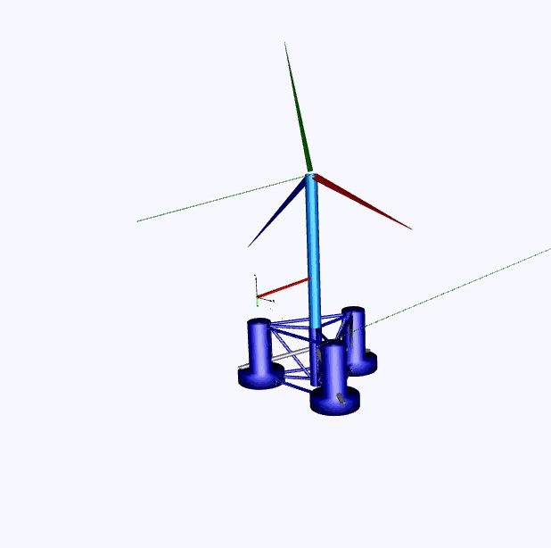
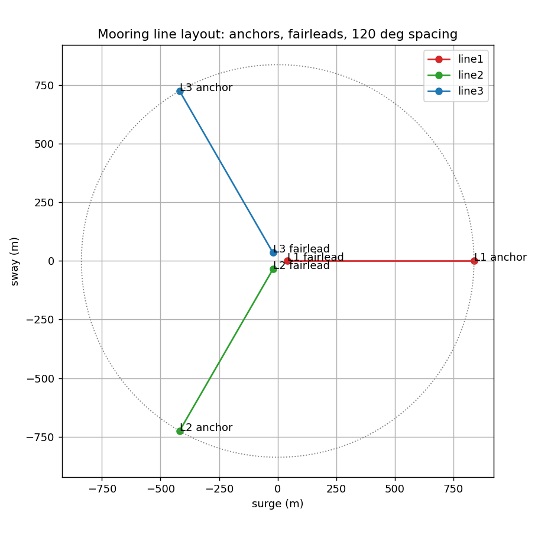
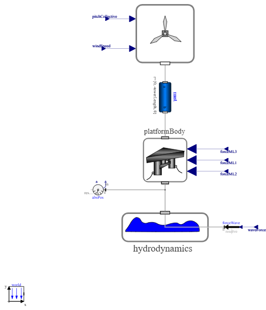
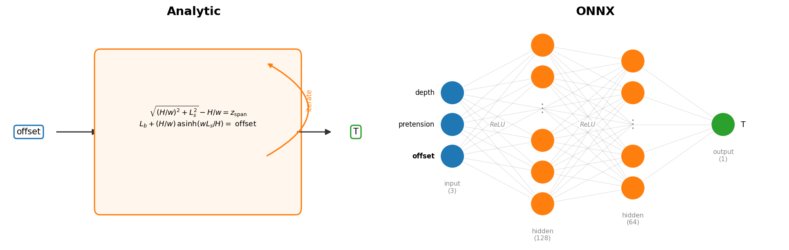
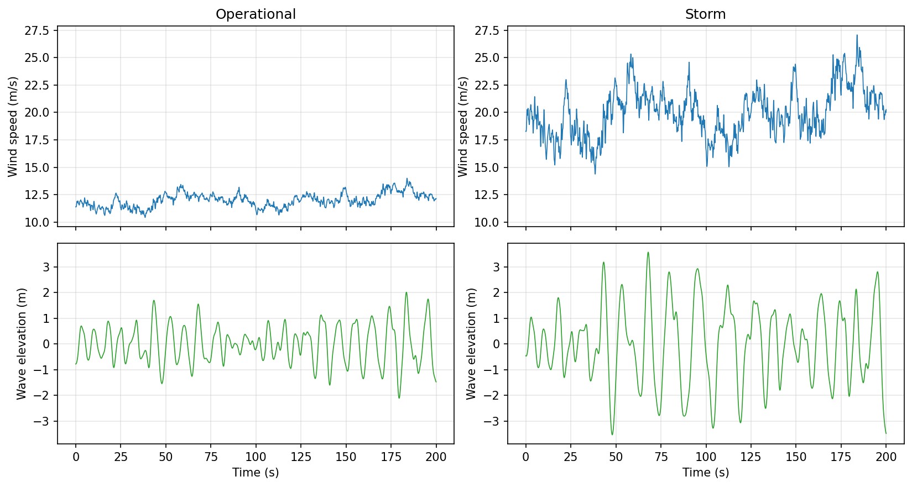
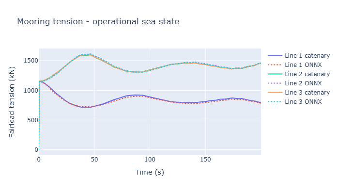
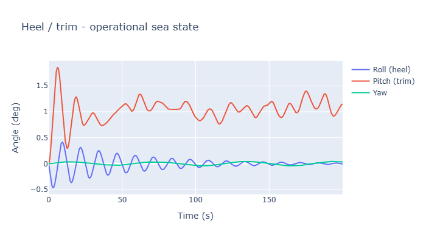
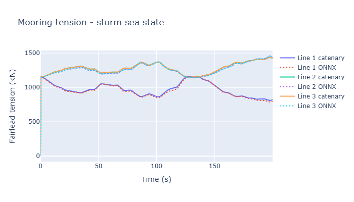
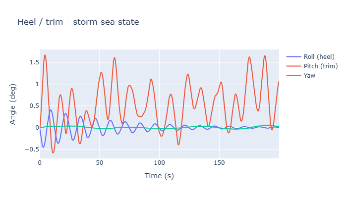

# It Moves Now

A floating wind turbine that never moves isn't telling us very much. Part 1 of
this series held the platform at a single frozen offset, a useful first
look at the mooring physics, but no real platform sits still. It surges,
heaves, and pitches continuously under wind and waves, restrained by three
mooring lines pulling in three different directions at once. Does the
machine-learning surrogate still keep pace with the analytical catenary
model once the platform is actually moving?

This post answers that by rebuilding the floating turbine as a full 6DOF
Modelica MultiBody model, exporting it as an FMU, and driving it from Python
under combined wind and wave loading, with either the analytical catenary or
Part 1's ONNX surrogate computing each line's force every step.



*The platform in motion: OpenModelica's native MultiBody animation, driven by
the same model that produces every number in this post.*

---

## Setting Up a Three-Line Floating Platform

I keep the same OC4 DeepCwind geometry from Part 1 and extend it to three
mooring lines at 120° spacing: 200 m water depth, 837.6 m anchor radius,
40.868 m fairlead radius, giving each line a 796.732 m nominal horizontal
fairlead-to-anchor offset (Part 1 used a single line of the same geometry).

Coordinates below use the reader-facing plan-view convention
(y = R·sin(azimuth)). The Modelica world frame the code and FMU actually
operate in flips the sway sign, as the plan-view caption notes.

| Line | Azimuth | Anchor (x, y, z) | Nominal horizontal offset |
| --- | --- | --- | --- |
| 1 | 0° | (837.6, 0.0, -200.0) m | 796.732 m |
| 2 | 120° | (-418.8, 725.3, -200.0) m | 796.732 m |
| 3 | 240° | (-418.8, -725.3, -200.0) m | 796.732 m |



*Plan view of the three-line layout: anchors, fairleads, and the nominal
796.7 m offset circle, all 120° apart. `line_geometry.py` uses
`-sin(azimuth)` for sway to match Modelica's `mooringLineNRotation` frame.*

I model the platform as a single rigid body riding on six stacked joints:
three prismatic joints for translation, then three revolute joints for
rotation. Heave, roll, and pitch use restoring springs:

| DOF | Stiffness |
| --- | --- |
| Heave | 3 836 kN/m |
| Roll | 1.453×10⁶ kN·m/rad |
| Pitch | 1.453×10⁶ kN·m/rad |

The model uses ρgI_waterplane directly as its roll and pitch spring,
giving 1.453×10⁹ N·m/rad. This is a simplified restoring term, not a
reconstruction of the published OC4 C44/C55 formulation. The net rotational
restoring of the assembled model has not been verified by linearization, so
the absolute roll and pitch values are illustrative. I use them only for the
like-for-like comparison between the two mooring implementations.

The heave spring is hard-coded to the published OC4 C33 value, 3 836 kN/m
(Robertson et al., 2014, [NREL/TP-5000-60601](https://github.com/senolvedat/Automation/blob/main/docs/benmarkpaper.pdf)).



*Top-level Modelica diagram exported to `FOWT.fmu`. `platformBody` receives
three mooring-force vectors. Python drives `pitchCollective`, `windSpeed`,
`waveForces`, and `waveMoments` every step.*

Rotor aerodynamics run in every simulation here. The model uses NREL 5-MW
blade geometry, Kaimal hub-height wind, and a `Ct(tipSpeedRatio, pitch)`
lookup from the ROSCO rotor-performance table. Collective pitch is fixed
once per run at the reference turbine's steady Region-3 operating point
(Jonkman et al. 2009, [NREL/TP-500-38060](https://www.nrel.gov/docs/fy09osti/38060.pdf),
Table 7-1): 3.83° at 12 m/s and 17.47° at 20 m/s. Rotor speed tracks the
optimal tip-speed ratio below rated wind and is capped at rated speed above
it. The model has no generator-power calculation or live
generator-speed/pitch controller, so it should not be read as a controller
study.

The two sea states are:

| Sea state   | Hs    | Tp   | Wind speed | Turbulence intensity |
| ----------- | ----- | ---- | ---------- | -------------------- |
| Operational | 2.5 m | 10 s | 12 m/s     | 6%                   |
| Storm       | 6.0 m | 14 s | 20 m/s     | 12%                  |

At 20 m/s hub-height wind the turbine remains below its 25 m/s cut-out.
"Storm" here means the upper operating range, not a parked extreme-storm
load case.

A JONSWAP spectrum supplies wave elevation. `environment/loads.py` converts
it into surge force and pitch moment. The FMU accepts full three-component
wave-force and wave-moment vectors, but this single-heading case excites only
surge and pitch. Wind speed drives rotor thrust in the FMU at every step, so
both wind and wave loads act together.

---

## Building the Dynamic Co-Simulation Loop

Two implementation details matter when reading the response. Surge and sway
have no hydrostatic restoring spring. The mooring lines supply all horizontal
restoring, with a quadratic viscous damper
(`f = quadraticDragCoefficient·v·|v|`, coefficient 3.95×10⁵ N·s²/m² from
NREL/TP-5000-60601 Table 4-5's published additional-drag term for
potential-flow-only models) to damp the numerically stiff externally-moored
DOFs. Yaw restoring stiffness is zero for the same reason: buoyancy gives no
yaw righting moment, so restoring comes entirely from the mooring lines'
own geometry (each fairlead offset rotates with platform yaw, recomputing
the line force each step). Three fairlead frames accept the mooring forces
as `forceML{1,2,3}[1..3]`. Wave force enters separately through
`waveForces[1..3]`, wave moment through `waveMoments[1..3]`.

I export the whole thing as a single FMI 2.0 co-simulation FMU with `omc`
(OpenModelica 1.27.0): `models/FOWT.fmu`, used for both sea states, since
wind and wave are fed in as external inputs rather than baked into the
model. From there, Python (`simulation/cosim_runner.py`, via FMPy's
`FMU2Slave`) steps the FMU at 0.02 s. The FMU embeds an implicit CVODE solver,
so it sub-steps its own stiff dynamics and this communication step only has to
sample the platform response:

```python
phi_ref = pitch_schedule(env["U_hub"])

for i in range(1, n):
    state = {key: series[key][i - 1] for key in MOTION_OUTPUT_NAMES}
    forces = []

    for line_index in range(3):
        fairlead = fairlead_world_position(state, line_index)
        fx, fy, fz, tension = resolve_line_force(
            anchors[line_index], fairlead, mooring_model)
        forces.extend([fx, fz, fy])

    fmu.setReal(mooring_vrs, forces)
    fmu.setReal(wave_vrs, [float(f_wave[i]), 0.0, 0.0])
    fmu.setReal(wave_moment_vrs, [0.0, 0.0, float(m_wave[i])])
    fmu.setReal([wind_vr, pitch_vr], [float(u_wind[i]), phi_ref])
    fmu.doStep(currentCommunicationPoint=t[i - 1],
               communicationStepSize=dt)
```



*One communication step: mooring forces feed the FMU, then its new 6DOF
state feeds the next mooring update. The loop runs about 10,000 steps per
sea state with collective pitch fixed for the run.*

This closes the feedback loop missing from a static benchmark. Each line's
fairlead-anchor offset comes from the previous FMU state. Translation moves
the fairlead directly, while rotation moves it through the platform rotation
matrix. The resulting line forces feed the next FMU step.

Heave remains part of the 6DOF platform dynamics, but the Part 1 surrogate
consumes horizontal fairlead-anchor offset only, so instantaneous vertical-
span changes are not passed into the mooring model. For the heave amplitudes
seen here, that omission has a sub-percent effect on horizontal tension.

---

## Two Mooring Models, One Interchangeable Interface

Both mooring models implement the same `compute(horizontal_offset) -> dict`
interface, called once per line, three times per step:

- **`CatenaryMooring`**: Part 1's Newton catenary solve, used here as the
  analytical reference and capped at ~2100 kN at the 807.6 m taut limit.
- **`OnnxMooring`**: Part 1's cached MLP surrogate, clipped to the same taut
  cap so it never extrapolates past it.



*Same interface, different insides. `CatenaryMooring` solves the nonlinear
catenary equations for `H` and `L_b`. `OnnxMooring` returns the same outputs
through the MLP frozen in Part 1.*

That swap happens in the Python loop, not inside the `.mo` model. Wolfram
System Modeler ships a built-in ONNX-import block, so the surrogate could
sit inside the Modelica diagram there. OpenModelica 1.24.4 has no
equivalent, so I push the boundary out to the FMU's edge instead:
`FOWT.fmu` only ever sees three force vectors over `forceML{1,2,3}`, and
`cosim_runner.py` decides one level above whether those came from a Newton
solve or an MLP. The FMU never needs to know which.

---

## Results in Both Sea States

Both sea states from the table above ran the full 200 s, each under both
mooring models.



*Kaimal wind and JONSWAP wave inputs supplied to the FMU in both sea states.*



*Operational sea state. Catenary (solid) against ONNX (dotted).*



*Heel, trim, and yaw, operational sea state.*

The operational case develops a substantial mean surge offset, consistent
with sustained rotor thrust near its fixed operating point, while pitch
reflects the combined wind, wave, and hydrostatic loading. I do not isolate
the individual load contributions here. All three lines remain below the
taut cap.



*Storm sea state. Catenary (solid) against ONNX (dotted).*



*Heel, trim, and yaw, storm sea state.*

Mean surge is *lower* in the storm case, not higher, because mean rotor
thrust is lower: with the fixed Region-3 pitch schedule, the blades feather
further at 20 m/s (17.47°) than at 12 m/s (3.83°) to hold power near rated,
and thrust falls off as a result. Turbulence and waves are stronger in the
storm case. Thrust standard deviation rises from 54 to 156 kN, and line 1's
settled tension range widens from 210 to 355 kN. Lines 2 and 3 change little.
Mean surge alone is therefore a poor storm-severity metric here.

| Quantity | Operational | Storm |
| --- | --- | --- |
| Surge, mean | 8.74 m | 4.61 m |
| Surge, std | 1.93 m | 2.43 m |
| Surge, max abs | 12.98 m | 9.11 m |
| Heave, dynamic range | 0.07 m | 0.06 m |
| Roll (heel), max abs | 0.31° | 0.33° |
| Pitch (trim), max abs | 1.40° | 1.65° |
| Yaw, max abs | 0.04° | 0.06° |
| Rotor thrust, mean / std | 594 / 54 kN | 314 / 156 kN |
| Blade pitch (fixed) | 3.83° | 17.47° |
| Tension 1, settled range | 714 – 924 kN | 809 – 1164 kN |
| Tensions 2 & 3, settled range | 1308 – 1598 kN | 1148 – 1438 kN |

Each result is one deterministic 200 s realization with seed 42. That is
enough for this catenary-versus-surrogate comparison, but not for
environmental extremes or design loads. The wave load is an unvalidated
Morison-type proxy with fixed `A_wp = 40 m²`, inertial coefficient `1e6`,
and a 10 m pitch-moment arm. The platform inertias are also adopted effective
values, not the published OC4 hull inertias. Together with the simplified
rotational hydrostatics, these choices make the absolute response
illustrative rather than predictive.

Statistics above skip the first 20 s while the platform settles from its
initial condition. Every peak and trough above occurs well inside the
window, a genuine settled-response value rather than a first-step artifact.
Roll is the exception: its reported 0.31-0.33° in both sea states lands right
at the 20 s cutoff itself, part of the initial-condition decay rather than the
forced response. Pushing the cutoff to 60 s brings both down to about
0.14-0.15°, nearly identical between sea states either way, since neither the
mooring's yaw restoring nor the fixed rotor gives roll much to react to at
either wind speed.

---

## What the Surrogate Changes

Part 1 only tested the surrogate against a frozen horizontal offset. Here its
force predictions are fed back into a moving platform, and that motion becomes
the next mooring input. Across both sea states, the mean absolute tension
difference stays near 10 kN and the maximum reaches 23-27 kN across sea
states, against line tensions in the 0.7-1.6 MN range across the settled
window.

The effect on the platform trajectory is concentrated in surge:

| DOF | Op RMSE | Op max\|Δ\| | Storm RMSE | Storm max\|Δ\| |
| --- | --- | --- | --- | --- |
| Surge | 0.23 m | 0.38 m | 0.19 m | 0.53 m |
| Heave | 6 mm | 7 mm | 6 mm | 7 mm |
| Pitch | 0.018° | 0.023° | 0.014° | 0.028° |

Surge RMSE is roughly 2-4% of each sea state's mean offset, so the
difference is measurable rather than numerical dust. Heave and pitch RMSE
stay small, ~6 mm and ~0.014-0.018°. Sway stays under 7 mm. Roll and yaw
differences stay below 0.0025° in both cases.

The surrogate's largest effect appears where the mooring matters most in
this model: surge. Its errors do not spread equally into every platform
motion.

Both mooring models are still quasi-static. `compute(offset)` returns the
equilibrium tension for a given offset, with no line mass, inertia, or
added-mass dynamics of its own. Real chain has weight and drag that lag
the platform's motion. Snap loads and line resonance are therefore outside
what either the catenary model or a surrogate trained on it can produce.

---
