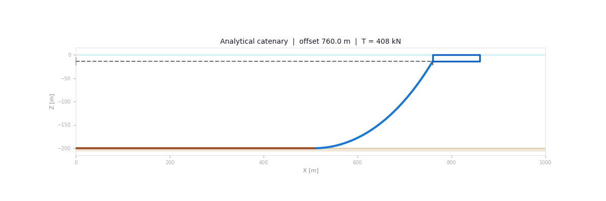
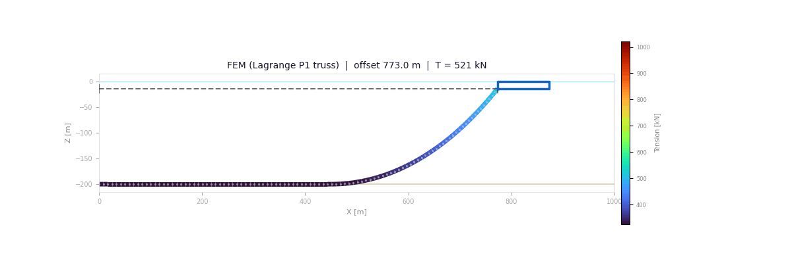
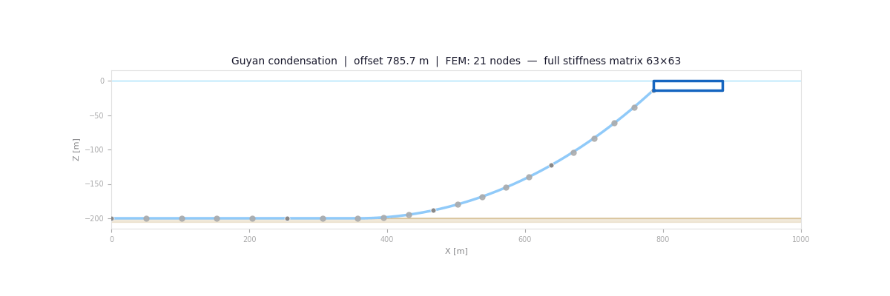
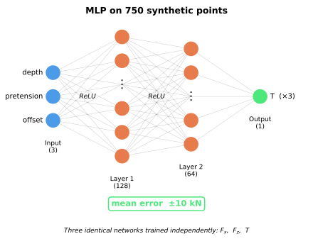
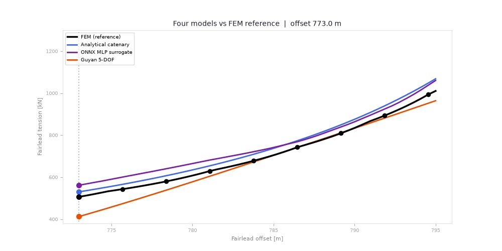

# One line. Four models. Which one, and when?

Mooring lines bend, sag, drag along the seabed, and reshape with every platform motion.
What force does that shape put on the platform right now?

The answer drives early design, safety margins, and real-time controllers alike. Of those real-line behaviours, the models here
capture sag and seabed contact but treat the chain as a quasi-static cable, with no bending
stiffness and no hydrodynamic drag. Four models answer the force
question: an analytical catenary, a finite element model, a Guyan-reduced stiffness model, and a
neural surrogate. Their warm query costs differ by nearly three orders of magnitude on this small
benchmark. How each one scales matters more than the raw timing itself.

This post benchmarks all four on the OC4 DeepCwind semi-submersible geometry,
defined in Robertson et al. (2014),
[NREL/TP-5000-60601](https://doi.org/10.2172/1155123).
Same line, same offset. Different fidelity, different cost.

*OC4 DeepCwind semi-submersible with NREL 5MW turbine undergoing circular surge (±10 m
radius, 12 s loop). Three catenary mooring lines at 0°/120°/240° update each frame:
brown = seabed contact segment, blue = suspended catenary.*

---

## The OC4 Setup

| Parameter                 | Value     |
| ------------------------- | --------- |
| Water depth               | 200 m     |
| Line length (unstretched) | 835.5 m   |
| Submerged weight          | 1 066 N/m |
| Nominal fairlead offset   | 796.7 m   |

The anchor sits at (0, −200) m; the fairlead at (796.7, −14) m in still water. A portion
of the line rests on the seabed. As touchdown moves, the changing suspended length alters the
line's restoring stiffness.

---

## The Analytical Catenary

How far does a closed-form answer get you? Surprisingly far. No specialist simulation stack,
sub-millisecond evaluation, and a broad operating range make this the natural first model and a
strong design-space sweep workhorse.

The oldest trick in mooring engineering: treat the line as an inextensible, flexible cable
under its own weight. Two equations, horizontal and vertical equilibrium, give a
closed-form shape once horizontal tension $H$ and seabed touchdown length $L_b$ are known.
A nonlinear root solver (SciPy `fsolve`) finds $(H, L_b)$ in under a millisecond.

$$
x_\text{span} = L_b + \frac{H}{w}\,\operatorname{arcsinh}\!\left(\frac{w L_s}{H}\right), \qquad
z_\text{span} = \sqrt{\left(\frac{H}{w}\right)^2 + L_s^2} \; - \; \frac{H}{w}
$$

$$
T_\text{fairlead} = \sqrt{H^2 + (w L_s)^2}
$$

where $w$ is submerged weight per unit length, $L_s = L - L_b$ is the suspended length,
and $(x_\text{span},\, z_\text{span})$ must match the anchor-to-fairlead geometry.

*Animation A: Line 1 shape as fairlead offset increases from 760 m to 805 m, staying below
the ≈814.5 m maximum reach of the inextensible 835.5 m line at 186 m vertical separation.*

**Result at 795 m:** T ≈ 1 068 kN, about 58 kN above the FEM. The direction of the difference is
consistent with the catenary's inextensible assumption: the FEM lets the line stretch and sag
slightly more. Fast and closed-form, but it reads a few percent above the FEM reference here.

> **Limitations:** Tension reported at fairlead only, so the spatial distribution along the
> line is unknown. No bending stiffness, no hydrodynamic drag.

---

## The Finite Element Model

What if the fairlead number is not enough, and you need the tension profile along the whole line,
from an elastic cable actually resting on the seabed? That takes a finite element model.

Line 1 is cut into 20 straight rod segments, **Lagrange P1 elements** (P1: displacement
varies linearly along each rod), carrying a 3D displacement vector
$(u_x, u_y, u_z)$ at each end node. **C0 continuity** means displacement is continuous across
element boundaries, with no gaps or jumps in shape, while strain (the derivative) can jump,
which is fine for a chain modelled as pin-jointed rods. The unknown field $\mathbf{u}(s)$
is the 3D displacement from a straight reference configuration at seabed depth. Deformed
position and Green–Lagrange axial strain:

$$
\frac{d\mathbf{x}}{ds} = \left(1 + \frac{du_x}{ds},\; \frac{du_y}{ds},\; \frac{du_z}{ds}\right), \qquad
E = \frac{1}{2}\!\left(\left\|\frac{d\mathbf{x}}{ds}\right\|^2 - 1\right)
$$

The chain cannot push ($E < 0$ → slack), so it carries a **tension-only axial resultant**
$N = EA\,\max(E, 0)$, zero in compression, the force work-conjugate to the Green–Lagrange strain
in the reference configuration. Here $EA$ is the axial stiffness, already in units of force, so
$N$ is in Newtons with no area or modulus conversion. The corresponding current-configuration
axial-force magnitude is $\lambda N$ with stretch $\lambda = \lVert d\mathbf{x}/ds \rVert$. At mooring strains ($\lambda - 1 \approx 10^{-3}$)
the two agree to about 0.1 %, so I report $N$. Internal virtual work and gravity loading:

$$
\delta W_\text{int} = N\,\frac{d\mathbf{x}}{ds}\cdot\frac{d\mathbf{v}}{ds}\,ds, \qquad
\delta W_\text{ext} = \mathbf{f}_\text{grav}\cdot\mathbf{v}\,ds, \quad
\mathbf{f}_\text{grav} = (0,\,0,\,-w)
$$

A one-sided contact penalty resists penetration below the seabed ($z < -200$ m), keeping the
slack portion close to the seabed instead of free-hanging below it. The tension-only tangent is singular wherever
elements go slack, so I ramp gravity in a few load steps and factor each tangent directly.
Newton–Raphson then converges in a handful of iterations. This implementation runs in a
DOLFINx v0.9.0 environment.

*Animation B: Nodal tension along Line 1 as offset sweeps 773 → 795 → 773 m.
White dots = 5 Guyan master nodes. Color = tension [kN].*

**Result at 795 m:** T ≈ 1 010 kN. The elastic line carries a little less than the inextensible
catenary's 1 068 kN because it can stretch (EA = 753.6 MN) and sag slightly more. Across the
773 → 795 m sweep the catenary sits ≈ 34 kN above it.

At the 796.7 m still-water equilibrium, the FEM reads 1 081.5 kN. As an external
reality check, the closely related OC5 DeepCwind tank tests measured a mean 1.122 MN across the
three lines ([Robertson et al., 2017](https://doi.org/10.1016/j.egypro.2017.10.333), Table 7). The
systems are similar rather than identical, so this is not strict validation. Interestingly, the
catenary at 1 151.5 kN sits slightly closer to that mean than the FEM.

I still use the FEM as the numerical reference because it retains line elasticity, seabed contact,
and spatial degrees of freedom, and because the Guyan model is derived from its tangent stiffness.
Higher fidelity does not guarantee a smaller error on every individual metric.

> **Reference-model limits:** 20-element P1 truss with penalty seabed contact; no mesh-convergence or
> contact-sensitivity study and no cross-check against MoorDyn or OrcaFlex. No bending stiffness,
> hydrodynamic drag, or dynamics are modeled here. It is a numerical reference, not ground truth.

---

## Guyan Reduction

What if the simulation loop tracks small motions and cannot afford a full FEM solve? Guyan reduction keeps only the degrees of freedom that matter.

Guyan reduction partitions the full FEM stiffness matrix $\mathbf{K}$ into master (retained)
and slave (condensed) DOFs:

$$
\begin{bmatrix}\mathbf{K}_{mm} & \mathbf{K}_{ms}\\ \mathbf{K}_{sm} & \mathbf{K}_{ss}\end{bmatrix}
\begin{bmatrix}\mathbf{u}_m\\ \mathbf{u}_s\end{bmatrix} =
\begin{bmatrix}\mathbf{f}_m\\ \mathbf{0}\end{bmatrix}
$$

Static condensation eliminates slave DOFs analytically:

$$
\mathbf{K}_r = \mathbf{K}_{mm} - \mathbf{K}_{ms}\,\mathbf{K}_{ss}^{-1}\,\mathbf{K}_{sm}
$$

I keep **5 nodes** at the line quartiles (anchor, quarter-span, mid-span, three-quarter-span,
and fairlead), an even spatial sampling that captures the line shape without tuning the reduction
to any one load case. This gives a $15\times15$ reduced system $\mathbf{K}_r$ (5 nodes × 3 DOF/node)
assembled once at a fixed 785.7 m reference offset, chosen where the FEM converges
reliably. Subsequent queries need only a single small linear solve, with no Newton iteration and
no re-assembly.

*Animation C: 21 FEM nodes condense to 5 master nodes / 15 DOFs (red) at the line quartiles:
anchor, quarter-span, mid-span, three-quarter-span, fairlead. Remaining nodes (gray) are
eliminated analytically.*

**Result at 795 m:** T ≈ 964 kN, about 47 kN below the FEM at this 9 m excursion. Within ±1 m
of the assembly offset it tracks the full FEM to a few kN. The error grows toward ~94 kN at the
slack end because $\mathbf{K}_r$ is a single fixed linearization. Mean ≈ 31 kN over the sweep, the lowest mean error of the three approximations.

> **Limitations:** Single-point linearization, so accuracy degrades for large excursions. Five
> retained nodes give partial spatial resolution. Mass and damping are not condensed.

---

## The Data-Driven Model

Can the iterative solve disappear from runtime entirely? Bake the solver response into weights: inference replaces the solver, and the result drops into any co-simulation environment.

The surrogate uses **750 synthetic catenary points** on a
$30\times5\times5$ grid of offsets, pretension factors, and water depths, then trains a
two-hidden-layer MLP (128 → 64 neurons, ReLU, Adam):

$$
\hat{y} = W_3\,\sigma\!\bigl(W_2\,\sigma(W_1\,\mathbf{x} + \mathbf{b}_1) + \mathbf{b}_2\bigr) + b_3, \qquad \sigma = \text{ReLU}
$$

*Figure E: MLP architecture (3 → 128 → 64 → 1). Independent networks are trained for $F_x$, $F_z$, and $T$.*

Three ONNX files (one per output: $F_x$, $F_z$, $T$) are exported and wrapped in an
FMI2 FMU for direct Modelica integration. Inference is $<1\,\text{ms}$ per query.

**Result at 795 m:** T ≈ 1 060 kN. It learned the inextensible catenary, so against the elastic FEM
it inherits that model's offset. Mean ≈ 45 kN across the 773 → 795 m sweep, the largest of the
four. (Against the catenary it was trained on, it sits within ≈ 10 kN.)

The surrogate reproduces its teacher closely, but it also reproduces its teacher's assumptions.
Low regression error is not the same as physical fidelity: this MLP inherits the catenary's
inextensibility and zero drag no matter how tightly it fits the training data.

> **Limitations:** Predicts fairlead forces only, with no spatial quantities. The three outputs
> ($F_x$, $F_z$, $T$) are trained independently, so force-magnitude consistency
> ($T = \sqrt{F_x^2 + F_z^2}$) is not explicitly enforced. Extrapolation outside the training
> geometry is unvalidated.

---

## Benchmarking the Four Models

Four approaches, same geometry, same load case. Here is where they land against the FEM reference.

*Animation D: All four models sweeping 773 → 795 m against the FEM reference (black
dots).*

| Model                                | Mean Error [kN] | Max Error [kN] | Median runtime       |
| ------------------------------------ | ------------------------- | ------------------------------- | -------------------- |
| FEM (dolfinx, extensible)            | 0 (reference)             | 0 (reference)                   | 13.4 ms (warm solve) |
| Guyan (5 nodes / 15 DOF, linear MOR) | ≈ 31                     | ≈ 94                           | 0.016 ms / query     |
| Analytical catenary                  | ≈ 34                     | ≈ 58                           | 0.067 ms             |
| ONNX MLP (750 pts)                   | ≈ 45                     | ≈ 60                           | 0.031 ms             |

*Runtime: median of 2 000 warm evaluations at 795 m on one 11th-gen Intel laptop. One-time costs
are excluded: FEM startup/form compilation is
≈ 2.6 s, and Guyan assembly is ≈ 16 ms.*

This is a warm, fixed-state microbenchmark. The absolute times belong to this small problem. The
useful takeaway is that a fixed-size reduced or surrogate model can decouple online query cost from
the full FEM mesh.

---

## When to Use Which Model?

### Decision guide

| Scenario                                                     | Recommended model            |
| ------------------------------------------------------------ | ---------------------------- |
| Feasibility, design sweeps, optimization loops               | **Analytical**         |
| Full tension profile                                         | **FEM**                |
| Near-linearization-point real-time loop, FEM-derived tangent | **Guyan**              |
| Solver-free deployment (Python, embedded, co-simulation)     | **Data-driven (ONNX)** |

> **Hybrid strategy:** train the data-driven model on FEM outputs (rather than catenary)
> to inherit the FEM's elasticity, geometric nonlinearity, and seabed-contact response while
> keeping <1 ms inference.

The pattern matters more than the ranking: the inextensible catenary and its surrogate sit high,
while the fixed Guyan linearization pulls low and degrades away from its assembly point. The practical
choice is the least expensive model whose error envelope and outputs fit the decision you need to make.

---
