# More Grip, Better Tracking? Modeling the Tradeoffs

The slip reading improves. The web stays off centre. Has more nip force
solved the problem?

In this simulated film-winding line, increasing nip load cuts accumulated
slip by 66%, while final lateral offset changes by less than 1%.

We use **Roll2RollDynamics**, an internal Modelica library, to couple roller
motion and elastic web spans with lateral tracking and frictional contact.
Its yaw steering, runout tension ripple and closed-loop tension tracking
are checked against published measurements [1–4]; nip contact under
crossed or tilted axes rests on consistency checks only.
With tension controls active, we examine nip loading, alignment and friction,
then trace a runout disturbance into neighbouring spans. These experiments
demonstrate modeling capability using assumed parameters without production
line calibration. Numerical results apply to these settings.

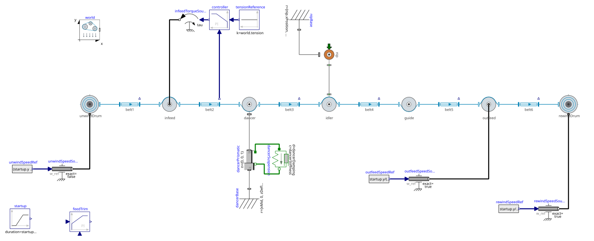

*Figure 1. OpenModelica diagram view of the `UnparallelIdler` assembly
connecting unwind, spans, misaligned idler, nip and rewind.*

## Increasing Nip Load at Fixed Misalignment

Can more nip load restore tracking? A dragging idler bearing needs traction
as tension falls. The nip presses the web onto that idler, whose axis is
yawed by 20 mrad, about 1.15 degrees. The nip housing remains machine-aligned.

The 600 mm wide, 125 micrometre thick PET web ramps to 2 m/s in 5 s, with
400 N nominal tension. The dancer, tension controller and unwinder feed
trim remain active throughout.

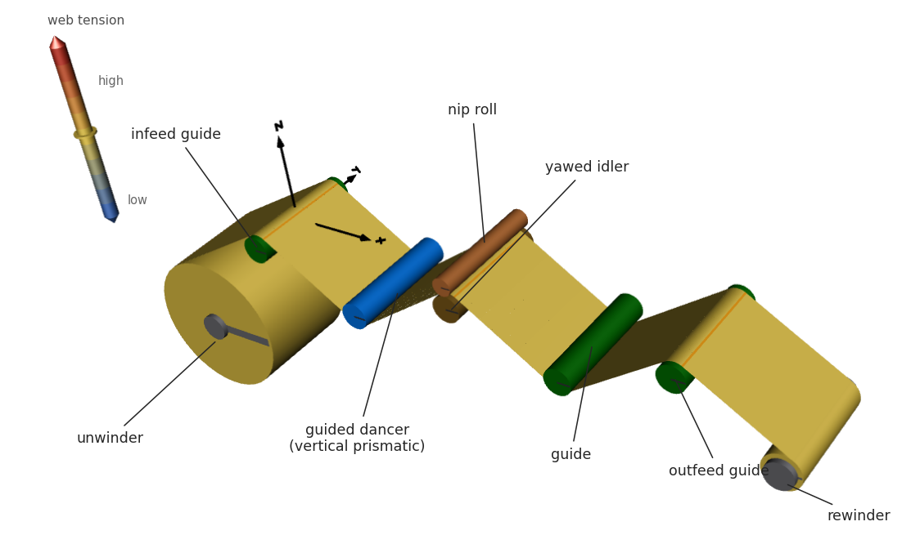

*Figure 2. Yawed startup, with the web coloured by tension.*

An undriven nip with 50 mm radius and 660 mm face width sits above the
idler on a rigid housing. Full-width stiffness `k = 1 MN/m` gives
`N = kδ = 1000 N` at parallel compression `δ = 1 mm`. Parameter
`maxNipLoad = 1000 N` denotes maximum actuator force, a limit this
imposed-compression housing does not enforce. Bearing coefficient
`b = 0.35 N·m·s/rad`, speed `v = 2 m/s` and idler radius `R = 0.075 m`
give demand `F = bv/R² = 124.4 N`. The wrapped web can supply about 177 N
at nominal tension under the assumed friction law, so the contact holds
with 53 N to spare. The post-ramp tension dip reduces that margin.

We hold bearing drag and idler angle fixed, with zero tram and runout.
Nip housing compression changes from clear to 0.25, 0.50, 0.75 and 1.00 mm.

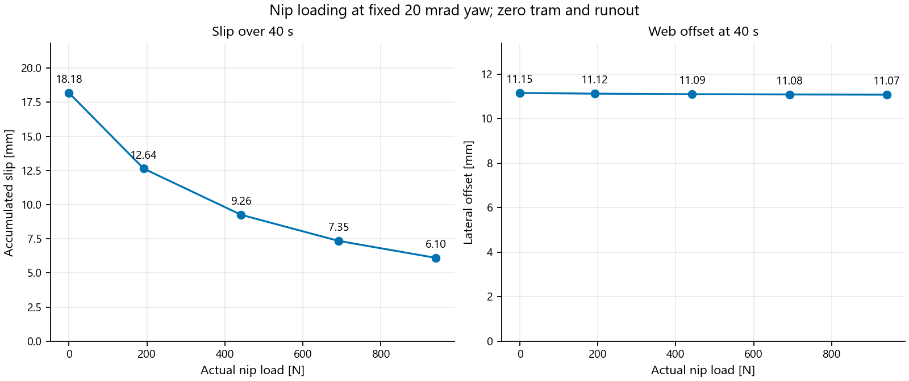

*Figure 3. At fixed misalignment, accumulated slip decreases by 66.4%;
final lateral offset decreases by only 0.7%. Both vertical axes start at zero.*

Over 40 s, increasing contact load from zero to 942 N cuts accumulated
slip from 18.18 to 6.10 mm. Offset stays about 11.1 mm, changing by less
than 0.08 mm. More load neither corrects nor increases the tracking error
meaningfully here. This sweep imposes compression and measures force;
it does not represent a force-controlled actuator.

## Connecting the Dynamics to Engineering Questions

What can this coupled model reveal beyond a slip reading?

| Engineering question | Capability demonstrated here |
| --- | --- |
| Will more load correct tracking? | Slip and offset at fixed yaw. |
| Can nip friction change steering? | Lateral response and slip together. |
| What does alignment change? | Approximate footprint and load resultant. |
| What happens during startup? | Roller/web response with controls active. |
| Is the upstream signal sufficient? | Local tension response to runout. |

Bearing drag requires about 124 N of traction at speed. With the nip clear,
incoming tension dips to 255 N after the ramp while outgoing tension holds
about 380 N. Loading the nip reduces peak local slip from 0.78 to
0.183 mm/s. These cases retain active controls without isolating their
contribution.

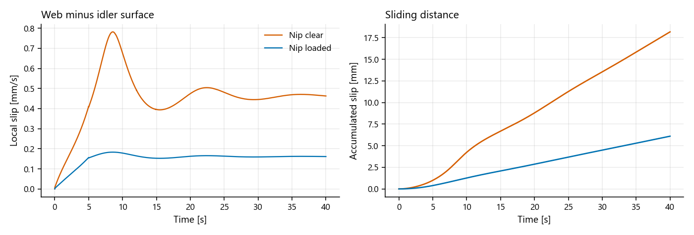

*Figure 4. Startup with the nip clear versus loaded: incoming tension dips
to 255 N and peak local slip falls from 0.78 to 0.183 mm/s.*

Why does slip never reach zero, even with the nip loaded? The friction
law. Classical Stribeck behaviour, reviewed by
[Olsson and colleagues](https://portal.research.lu.se/en/publications/friction-models-and-friction-compensation/),
falls from higher low-speed friction to a lower sliding value, with a
signed curve discontinuous at zero velocity. That discontinuity forces
stick/slip switching on the solver. Our Triple S regularization replaces
it with smooth transitions, continuous in force and slope at zero slip.

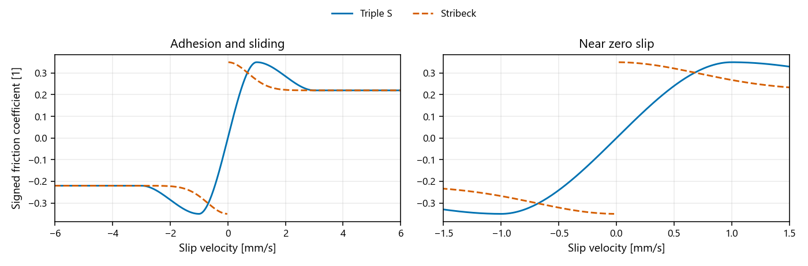

*Figure 5. Triple S replaces the zero-speed discontinuity with an
adhesion-slip region requiring finite slip for traction.*

Baseline adhesion peaks at 0.35 at 1 mm/s; sliding reaches 0.22 at
3 mm/s. The price of smoothness is that traction needs finite slip, so
a residual creep exists by construction and its absolute value depends
on the assumed curve parameters. Independent compression
springs along the nip face approximate the contact footprint, integrated
force and load-resultant position. They do not resolve an elliptical patch,
cross-face shear or a contact-stress field, and omit finite-face overlap
and wrapped-arc checks.

The following alignment and friction comparisons fix centre compression
at 1 mm. Yaw turns the idler about the vertical, keeping its ends level.
Tram tilts it about the machine direction, lifting one end. Alignment angles
of 1.15, 2 and 3 degrees are deliberate stress cases, not tolerances.

## Crossing the Axes: Yaw

Why does load fall at an unchanged housing setting? Crossing the idler and
nip axes opens a parabolic gap toward both face edges, reducing compression.
Ideal concentric cylinders retain this geometry as they rotate, so crossing
alone produces no once-per-revolution load ripple.

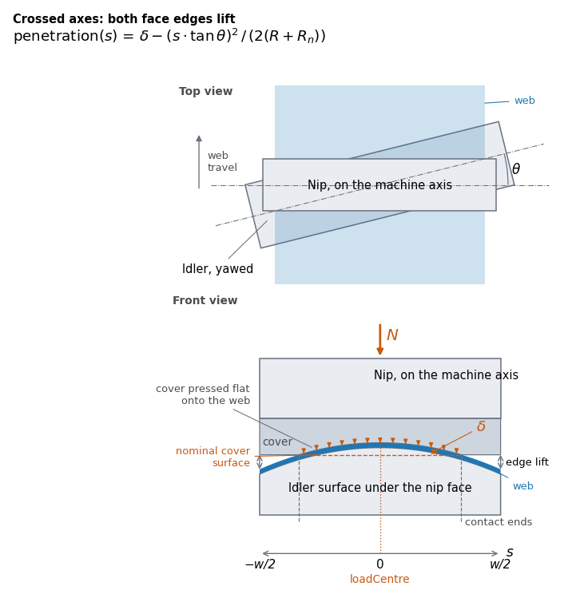

*Figure 6. Yaw lifts both face edges; the approximate footprint stays centred.*

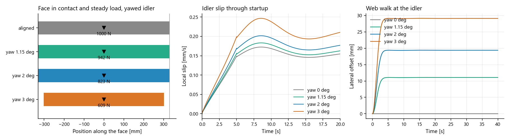

*Figure 7. At fixed centre compression, yaw lowers load and shifts the web's
steady position.*

At 3 degrees, 1.20 mm edge lift exceeds the 1 mm compression. The outer
28 mm of each nip face edge loses contact. Load falls from 1000 N aligned
to 609 N: a gauge reads 39% less force despite the unchanged housing setting.
The nip still adds about 213 N of adhesion capacity to the wrap's traction.
Accumulated slip rises from 5.80 to 7.90 mm, while lateral displacement
grows much more visibly.

An entering web tends toward perpendicularity with the receiving roller,
the normal-entry principle described in
[Shelton's *Lateral Dynamics of a Moving Web*](https://hdl.handle.net/20.500.14446/30409).
Offset settles near 11.1 mm at 1.15 degrees and 29.1 mm at 3 degrees.
The latter reaches a minimum nominal edge margin of -1.3 mm, indicating
overhang whose loss of support the lateral model does not resolve.

The crossed nip applies opposing lateral friction. Each contact shares
its friction capacity between longitudinal and cross-machine motion.
At the original settings, nip action reduces offset by less than 0.1 mm:
sufficient traction still coexists with substantial tracking error.

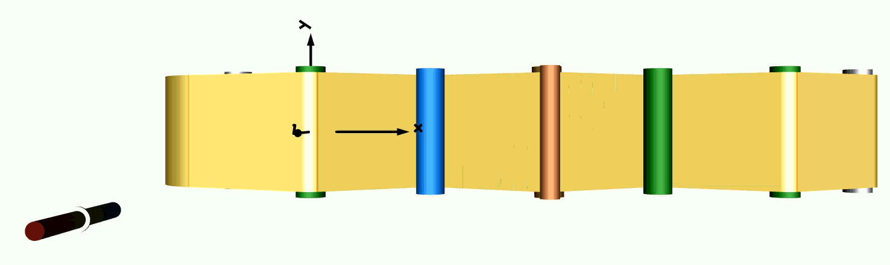

*Figure 8. Yawed startup toward a displaced steady position.*

## Increasing Nip Friction

Can stronger friction change that balance? At 20 mrad yaw, we scale only
nip adhesion and sliding coefficients by 1, 2 and 3: pairs of 0.35/0.22,
0.70/0.44 and 1.05/0.66. Other roller friction and slip-velocity thresholds
stay fixed. These assumed sensitivity settings represent no particular
cover material. Contact load remains about 942 N.

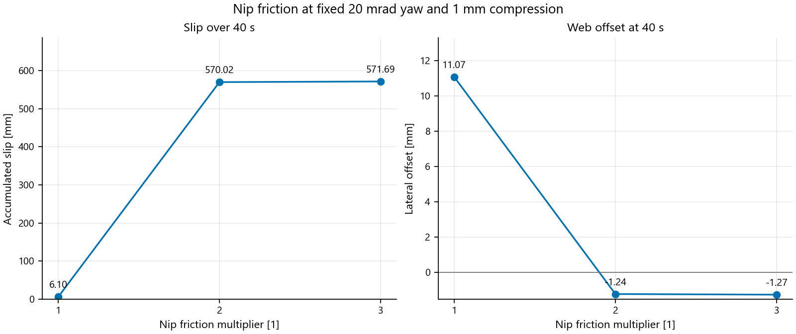

*Figure 9. Stronger passive steering accompanies sharply increased idler
slip. Negative offset is opposite the baseline side of centre. Markers
show three simulated settings.*

Doubling friction moves final offset from +11.07 to -1.24 mm; tripling
leaves it near -1.27 mm. Accumulated idler slip over 40 s rises from
6.10 to about 570–572 mm, roughly 94 times the baseline. The web ends
closer to centre, on the opposite side, with much greater longitudinal slip.

Nip orientation stays fixed, without lateral-position feedback. Both
contacts divide friction capacity between longitudinal and lateral motion,
coupling steering to slip. These settings demonstrate a tradeoff, without
establishing an optimum coefficient or locating the response transition.

## Tilting the Axis: Tram

Could high, steady load hide misalignment? Tram opens a wedge: one idler
end rises into the nip cover while the other falls away. Contact and its
load resultant shift toward the raised end.

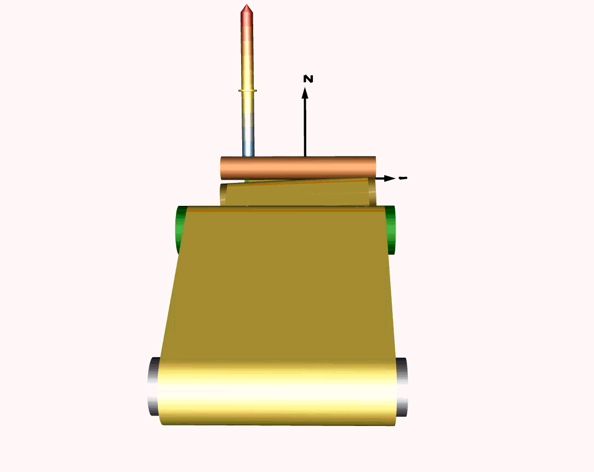

*Figure 10. One nip face end lifts clear while the raised end compresses
the cover.*

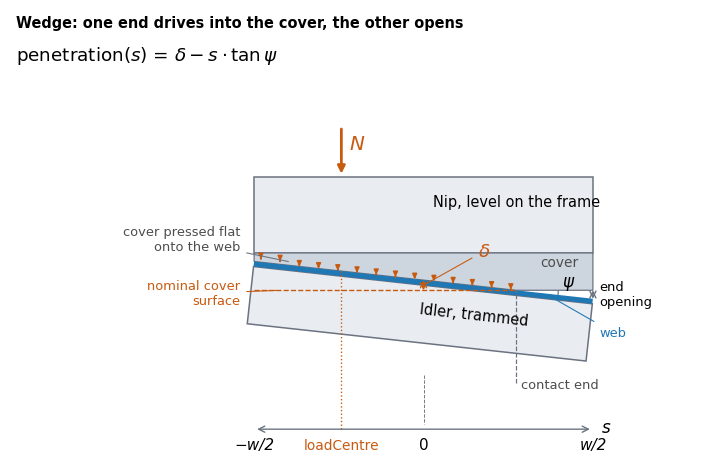

*Figure 11. Asymmetric contact under a rigid, level housing.*

At the rigid housing's fixed centre-line distance, tram redistributes
compression rather than relieving it: the raised end digs deeper into the
cover while the lowered end lifts clear. Below about 0.17 degrees the face
stays fully in contact and total load holds at the aligned 1000 N; past
that, the shrinking footprint carries the same centre-line penetration
over less width, and load climbs.

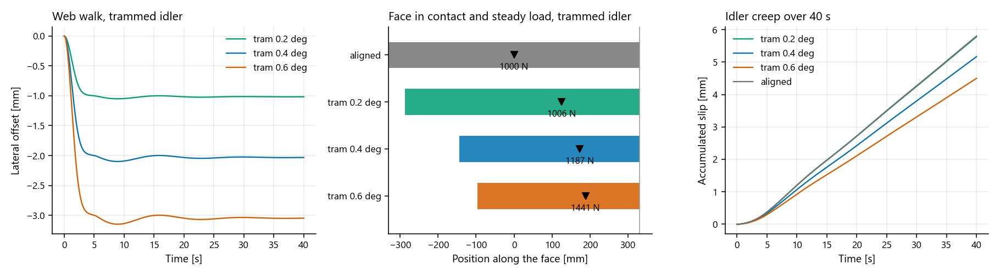

*Figure 12. Tram shifts contact toward one end while reducing simulated
creep. Load rises as the footprint narrows, on a rigid,
imposed-compression housing.*

At 0.2, 0.4 and 0.6 degrees, the footprint narrows from 660 mm aligned to
617, 474 and 426 mm; the load resultant moves 124, 172 and 188 mm off
centre. Nip load climbs from 1000 N aligned to 1006, 1187 and 1441 N: a
rigid housing turns a fraction of a degree of tram into load 44% above
the 1000 N actuator-force cap, without any change at the compression
gauge. A compliant or self-aligning housing would cap this instead of
letting it climb; this model has neither.

Through the entering span, descending from the dancer at 34 degrees,
tram steers toward the low end. Offsets settle between -1.0 and -3.1 mm,
opposite in sign and much smaller than the yaw cases. Lower creep and
higher total nip force therefore coexist with asymmetric contact and
displacement in this idealized model. Neither reading establishes correct
alignment.

## Finding a Local Tension Disturbance

Does low accumulated slip mean steady loading? We align the idler and give
the nip drum a 0.3 mm centre-offset amplitude, orbiting once per turn.
For this ideal circular drum, that means 0.6 mm peak-to-peak radial
indicator excursion. Plot labels use the 0.3 mm eccentricity amplitude.

Slip barely changes: 5.92 mm over 40 s versus 5.80 mm aligned and concentric.
Yet nip load cycles between about 700 and 1300 N.

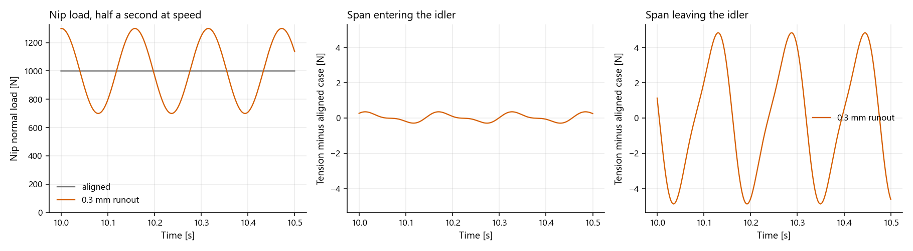

*Figure 13. Tension ripple is 9.7 N peak-to-peak downstream versus 0.69 N
entering the idler. Tension panels show differences from the aligned,
concentric case on matching vertical scales.*

Compression gains and loses 0.3 mm per revolution. At speed `v = 2 m/s` and
nip radius `R = 0.05 m`, the disturbance frequency is `f = v/(2πR) = 6.37 Hz`.
Ripple at the controlled span farther upstream is only 0.73 N peak-to-peak,
understating the local response.

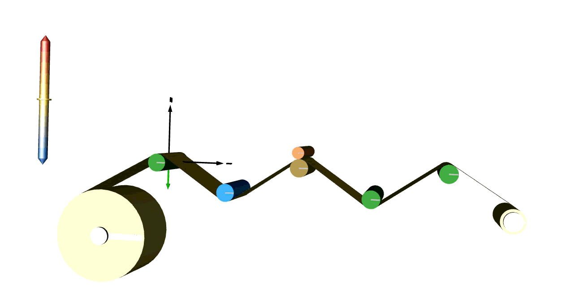

*Figure 14. Nip eccentricity adds a cyclic disturbance; web colour shows
tension.*

This gives an engineer reason to inspect local tension alongside the
controlled upstream signal. A disturbance at nip turning frequency makes
runout a candidate, but does not uniquely identify it. Branca, Pagilla
and Reid measured the same once-per-revolution mechanism on the Euclid
Web Line in *Web Tension Behavior in the Presence of Eccentric Rollers:
Modeling and Validation* (2011). Load range here follows the assumed
cover law; tension amplitudes lack machine calibration. Angular runout is
excluded.

## Using the Results

So, has more nip force solved the problem? It has fixed the slip reading.
Accumulated slip fell 66% and the web stayed 11 mm off centre. Lateral
steering comes from idler geometry, and nip load leaves that geometry
alone. The slip gauge improved because traction improved, which says
nothing about where the web runs.

Each experiment separates a variable that a single reading conflates:

- **Nip load** buys traction. Slip down 66%, offset down 0.7%.
- **Nip friction** buys steering, paid in slip. Doubling the coefficient
  moves the web from +11.07 mm to -1.24 mm, while idler slip rises 94×.
- **Yaw** at 3 degrees lifts both face edges and drops measured load
  39% with the housing setting unchanged. The gauge reads the geometry,
  not the actuator.
- **Tram** shifts the footprint to one end, moves the load resultant up
  to 188 mm off centre, and raises load 44% above the 1000 N aligned
  reading at the same housing setting.
- **Runout** leaves accumulated slip almost unchanged (5.92 versus
  5.80 mm) while nip load swings between 700 and 1300 N. The controlled
  upstream span sees 0.73 N of ripple against 9.7 N downstream.

The pattern is the same each time. One measurement improves, or holds
steady, while a coupled quantity moves. A coupled model with controls
active exposes that second quantity before anyone treats the first as a
resolution. Fix the alignment first. Then spend nip force on traction,
and measure both.

The study establishes neither safe operating limits nor wrinkle onset.
Wrinkle prediction needs cross-width stress and structural analysis beyond
this lumped model. Machine-specific results also need representative
friction and contact properties.

## References

1. J. J. Shelton, *Lateral Dynamics of a Moving Web*, PhD dissertation,
   Oklahoma State University, 1968.
   [OSU repository](https://hdl.handle.net/20.500.14446/30409).
2. Yun, Lee, Jang, Kim, Kim and Lee, "Sensor-Efficient Estimation of
   Lateral Web Position in Roll-to-Roll Film Processing," *Polymers*
   17(21):2907, 2025. [doi:10.3390/polym17212907](https://doi.org/10.3390/polym17212907).
3. N. Branca, P. R. Pagilla and K. N. Reid, "Web Tension Behavior in the
   Presence of Eccentric Rollers: Modeling and Validation," *Proc.
   International Conference on Web Handling*, Oklahoma State University,
   2011. [Open Research Oklahoma](https://openresearch.okstate.edu/).
4. J. Kim, K. Kim, H. Kim, P. Park, S. Lee, T. Lee and D. Kang,
   "Experimental Validation of High Precision Web Handling for a
   Two-Actuator-Based Roll-to-Roll System," *Sensors* 22(8):2917, 2022.
   [doi:10.3390/s22082917](https://doi.org/10.3390/s22082917).
